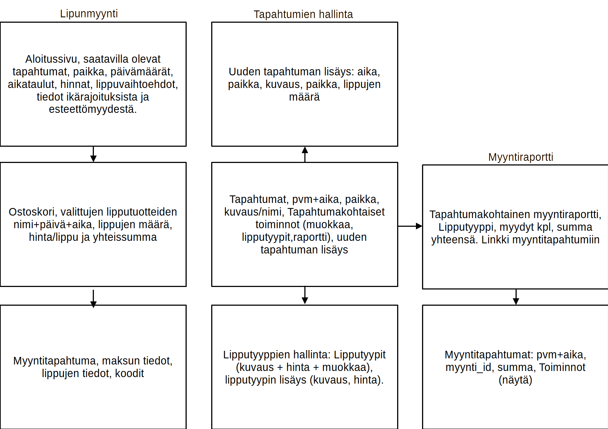
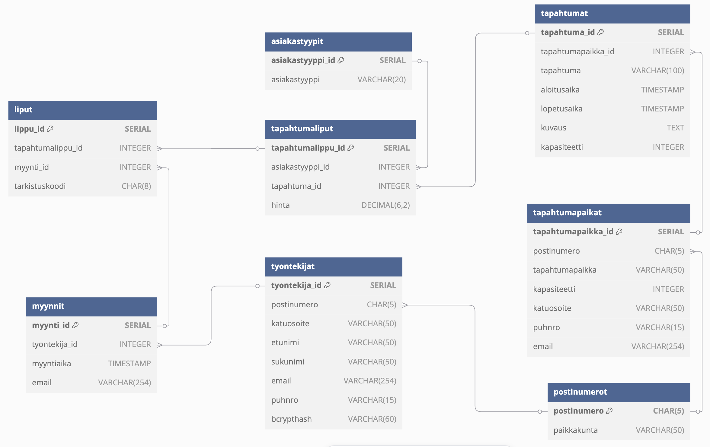

# TicketGuru

Tiimi: Lotta Gardin, Jenni Järvinen, Anni Lehtimäki, Miika Nordblad, Samuli Tani

## Johdanto

TicketGuru on lipputoimistolle tuleva lipunmyyntijärjestelmä, jossa pystyy myymään sekä tulostamaan pääsylippuja, sekä tarkistamaan pääsylippujen tietoja. Järjestelmässä voidaan määritellä erilaisia lipputyyppejä ja lippujen hintoja sekä lisätä, poistaa ja muokata tapahtumia, joihin lippuja myydään. Järjestelmän kautta saadaan myös kerättyä dataa asiakkaiden ostokäyttäytymisestä myyntiraporttien muodossa.

Järjestelmää käyttävät pääsääntöisesti lipunmyyjät, lipuntarkastajat sekä järjestelmän ylläpitäjä, mutta tulevaisuudessa lipunmyyntijärjestelmä laajentuu verkkokaupaksi, jolloin sen käyttäjiksi tulevat myös lippuja ostavat asiakkaat.

## Järjestelmän määrittely

Lipunmyyntijärjestelmän käyttäjärooleja ovat myyjä, asiakas, lipuntarkastaja ja järjestelmän ylläpitäjä. Myyjä myy ja tulostaa liput asiakkaalle lipunmyyntipisteessä. Lisäksi myyjä tulostaa myymättä jääneet liput tapahtumapäivänä ovella myytäväksi. Asiakas ostaa lipun myyjältä lipunmyyntipisteessä. Lipuntarkastaja tarkastaa liput ovella tapahtuman alkaessa lippuun merkityn koodin avulla ja merkitsee tarkastetut liput käytetyiksi. Järjestelmän ylläpitäjä huolehtii sen toiminnasta lippukaupan jokapäiväisessä toiminnassa.

### Käytettävät teknologiat

- Frontend: React.js
- Backend: Java Spring Boot
- Tietokanta: H2 Database tai PostgreSQL
- Päätelaitteet: Lipunmyyntijärjestelmää pystyy käyttämään tietokoneella, sekä tabletilla ja mobiililaitteella selaimessa.

### Käyttäjätarinat

#### Myyjä

- Myyjänä haluan pystyä myymään ja tulostamaan lipun asiakkaalle muutamalla klikkauksella, jotta myyntitilanne etenee sujuvasti eikä jono kasva liian pitkäksi.
- Myyjänä haluan lisätä useita lippuja samaan myyntitapahtumaan, jotta perhe- ja ryhmäasiakkaat saavat kaikki lippunsa yhdellä kertaa.
- Myyjänä haluan voida myydä opiskelija-, eläkeläis- ja varusmiesalennuksia, jotta mahdollisimman monella olisi mahdollisuus hankkia lippuja tapahtumiin.
- Myyjänä haluan nähdä jäljellä olevien lippujen määrän, jotta voin kertoa asiakkaalle, onko tapahtumaan vielä tilaa.
- Myyjänä haluan, että järjestelmä estää lipun myynnin, kun tapahtuman maksimikapasiteetti on saavutettu, jotta kaikki lipun ostaneet varmasti mahtuvat tapahtumapaikalle.
- Myyjänä haluan pystyä peruuttamaan myyntitapahtuman ennen maksun suorittamista, jotta voin korjata virheelliset syötöt nopeasti.
- Myyjänä haluan tarkastella päivän myyntiraportteja helposti, jotta voin varmistaa, että kassa täsmää ja kaikki myyntitapahtumat on kirjattu oikein.

#### Asiakas

- Asiakkaana haluan, että sopivan tapahtuman etsiminen ja valitseminen on nopeaa, jotta lipun ostaminen olisi sujuvaa.
- Asiakkaana haluan, että eri tapahtumien hinnat ovat selkeästi nähtävissä, jotta voin valita itselleni parhaan vaihtoehdon.
- Asiakkaana haluan, että ostostani jää tiedot sähköpostiini tai lipunmyyjälle siltä varalta, että hukkaan lippuni.
- Asiakkaana haluan saada kuitin ja oston ehdot, jotta tiedän, onko lipuillani palautus- tai vaihto-oikeutta.
- Asiakkaana haluan, että ostoskorin liput ovat selkeästi listattu, jotta voin itse tarkastaa, että ostamani liput ovat juuri haluamiani.
- Asiakkaana haluan, että lipussa on selkeästi näkyvillä olennaisimmat tiedot, kuten aika ja paikka, ettei tule sekaannuksia tapahtumien kesken.
- Asiakkaana haluan, että voin helposti kysyä jäljellä olevien lippujen tilanteen, jotta tiedän, onko minulla kiire kysellä seuraa tapahtumaan.

#### Lipuntarkastaja

- Lipuntarkastajana haluan pystyä tarkastamaan lipun aitouden, ettei tapahtumaan pääse väärennetyillä lipuilla.
- Lipuntarkastajana haluan tarkastaa lipun voimassaolon lukemalla lippuun merkityn koodin ja merkitä sen käytetyksi, jotta voin varmistaa, että vain lipun ostaneet pääsevät sisään tapahtumaan.
- Lipuntarkastajana haluan, että lipussa on QR-koodi, jotta jono ei kasvaisi liian pitkäksi ja asiakkaat eivät turhautuisi.

#### Ylläpitäjä

- Ylläpitäjänä haluan pystyä lisäämään tapahtumia, jotta uusien tapahtumien liput saadaan myyntiin.
- Ylläpitäjänä haluan pystyä muokkaamaan tapahtumia, jotta tapahtumien tiedot pysyvät ajan tasalla lippukaupassa.
- Ylläpitäjänä haluan pystyä poistamaan tapahtumia, jotta menneet tapahtumat eivät näy enää lippukaupassa.
- Ylläpitäjänä haluan nähdä myyntiraportit, jotta voin tarjota dataa asiakkaiden ostokäyttäytymisestä.
- Ylläpitäjänä haluan pystyä muokkaamaan lipputyyppejä, jotta voin vastata asiakkaan mahdolliseen tarpeeseen lipputyyppien lisäämisestä ja poistamisesta, tai lippujen hinnan muutoksista.

## Käyttöliittymä




## Tietokanta
### UML-tietokantakaavio



> ### Asiakastyypit
>
> _Asiakastyypit-taulu sisältää tiedot tapahtumalipun asiakastyypeistä: asiakastyyppi (esimerkiksi lapsi, aikuinen, eläkeläinen, opiskelija) sekä asiakastyyppiId. Jokaisella lipulla on yksi asiakastyyppi, yksi asiakastyyppi voi olla usealla tapahtumalipulla._
>
> | Kenttä          | Tyyppi      | Kuvaus             |
> | --------------- | ----------- | ------------------ |
> | asiakastyyppi_id | int PK      | Asiakastyypin id   |
> | asiakastyyppi   | varchar(20) | Asiakastyypin nimi |

> ### Myynnit
>
> _Myynnit-taulu sisältää lipunmyyntiin liittyvät tiedot: myyntiId, tyontekijaId, myyntiaika ja asiakkaan sähköpostin. Jokainen myynti on yhden työntekijän tekemä, yksi työntekijä voi tehdä usean myynnin._
>
> | Kenttä       | Tyyppi      | Kuvaus                                        |
> | ------------ | ----------- | --------------------------------------------- |
> | myynti_id     | int PK      | Myyntitapahtuman id                           |
> | tyontekija_id | int FK      | Työntekijän Id, viittaus työntekijät -tauluun |
> | myyntiaika   | datetime    | Myyntipäivä ja aika                           |
> | email        | varchar(50) | Asiakkaan sähköpostiosoite                    |

> ### Postinumerot
>
> _Postinumerot-taulu sisältää postinumeron tiedot: postinumeron ja paikkakunnan. Postinumeroa käytetään tapahtumapaikan ja työntekijän tiedoissa. Postinumerolla voi olla tapahtumapaikkaa, mutta tapahtumapaikalla voi olla vain yksi postinumero._
>
> | Kenttä      | Tyyppi      | Kuvaus            |
> | ----------- | ----------- | ----------------- |
> | postinumero | int PK      | Postinumero       |
> | paikkakunta | varchar(50) | Paikkakunnan nimi |

> ### Tapahtumaliput
>
> _Tapahtumaliput-taulu sisältää tapahtumalippuun liittyvät tiedot: tapahtumalippuId, hinta, tapahtumaId ja asiakastyyppi. Tapahtumalipulla voi olla yksi asiakastyyppi, asiakastyyppi voi olla usealla tapahtumalipulla._
>
> | Kenttä           | Tyyppi | Kuvaus                                            |
> | ---------------- | ------ | ------------------------------------------------- |
> | tapahtumalippu_id | int PK | Tapahtumalipun id                                 |
> | hinta            | int    | Lipunhinta                                        |
> | tapahtuma_id      | int FK | Tapahtuman id, viittaus tapahtumat -tauluun       |
> | asiakastyyppi_id  | int FK | Asiakastyypin id, viittaus asiakastyypit -tauluun |

> ### Tapahtumapaikat
>
> _Tapahtumapaikat-taulu sisältää tapahtumapaikkaan liittyvät tiedot: tapahtumapaikan osoitteen, postinumeron, tapahtumapaikan nimen ja kapasiteetin, paljonko tilaan mahtuu ihmisiä. Tapahtumapaikalla voi olla yksi postiosoite, sama postiosoite voi olla usealla tapahtumapaikalla._
>
> | Kenttä            | Tyyppi      | Kuvaus                                                     |
> | ----------------- | ----------- | ---------------------------------------------------------- |
> | tapahtumapaikka_id | int PK      | Tapahtumapaikan id                                         |
> | postinumero       | int FK      | Tapahtumapaikan postinumero, viittaus postinumero -tauluun |
> | tapahtumapaikka   | varchar(50) | Tapahtumapaikan nimi                                       |
> | katuosoite        | varchar(50) | Paikan katuosoite                                          |
> | kapasiteetti      | int         | Paljonko ihmisiä tilaan mahtuu                             |

> ### Tapahtumat
>
> _Tapahtumat-taulu sisältää tapahtumaan liittyvät tiedot: tapahtuman nimen, tapahtumapaikan, aloitus- ja lopetusajan ja kuvauksen. Tapahtumalla voi olla yksi tapahtumapaikka, sama tapahtumapaikka voi olla usealla tapahtumalla._
>
> | Kenttä            | Tyyppi      | Kuvaus                                                |
> | ----------------- | ----------- | ----------------------------------------------------- |
> | tapahtuma_id       | int PK      | Tapahtuman id                                         |
> | tapahtumapaikka_id | int FK      | Tapahtumapaikan id, viittaus tapahtumapaikka -tauluun |
> | tapahtuma         | varchar(50) | Tapahtuman nimi                                       |
> | aloitusaika       | datetime    | Tapahtuman aloitusaika                                |
> | lopeutusaika      | datetime    | Tapahtuman lopetusaika                                |
> | kuvaus            | text        | Kuvaus tapahtumasta                                   |

> ### Työntekijät
>
> _Työntekijät-taulu sisältää työntekijään liittyvät tiedot: työntekijäId, postinumero, katuosoite, etunimi, sukunimi, email, puhelinnumero ja bcrypthash eli salattu salasana. Työntekijällä voi olla yksi postinumero, sama postinumero voi olla usealla työntekijällä._
>
> | Kenttä       | Tyyppi      | Kuvaus                                                 |
> | ------------ | ----------- | ------------------------------------------------------ |
> | tyontekija_id | int PK      | Työntekijän id                                         |
> | postinumero  | int FK      | Työntekijän postinumero, viittaus postinumero -tauluun |
> | katuosoite   | varchar(50) | Työntekijän katuosoite                                 |
> | etunimi      | varchar(50) | Etunimi                                                |
> | sukunimi     | varchar(50) | Sukunimi                                               |
> | email        | varchar(50) | Sähköpostiosoite                                       |
> | puhnro       | int         | Puhelinnumero                                          |
> | bcrypthash   | varchar(60) | bcrypt-salattu salasana                                |

> ### Liput
>
> _Liput-taulu sisältää lippuun liittyvät tiedot: LippuId, myyntiId, tapahtumalippuId ja tarkastuskoodin, jolla lippu voidaan tarkastaa tapahtumassa. Lipulla voi olla yksi postiosoite, sama postiosoite voi olla usealla tapahtumapaikalla._
>
> | Kenttä           | Tyyppi     | Kuvaus                                              |
> | ---------------- | ---------- | --------------------------------------------------- |
> | lippu_id          | int PK     | Lipun id                                            |
> | myynti_id         | int FK     | Myyntitapahtuman id, viittaus myynnit -tauluun      |
> | tapahtumalippu_id | int FK     | Tapahtumalipun id, viittaus tapahtumaliput -tauluun |
> | tarkastuskoodi   | varchar(8) | Lipun tarkastuskoodi                                |

## Tekninen kuvaus

Teknisessä kuvauksessa esitetään järjestelmän toteutuksen suunnittelussa tehdyt tekniset
ratkaisut, esim.

- Missä mikäkin järjestelmän komponentti ajetaan (tietokone, palvelinohjelma)
  ja komponenttien väliset yhteydet (vaikkapa tähän tyyliin:
  https://security.ufl.edu/it-workers/risk-assessment/creating-an-information-systemdata-flow-diagram/)
- Palvelintoteutuksen yleiskuvaus: teknologiat, deployment-ratkaisut yms.
- Keskeisten rajapintojen kuvaukset, esimerkit REST-rajapinta. Tarvittaessa voidaan rajapinnan käyttöä täsmentää
  UML-sekvenssikaavioilla.
- Toteutuksen yleisiä ratkaisuja, esim. turvallisuus.

Tämän lisäksi

- ohjelmakoodin tulee olla kommentoitua
- luokkien, metodien ja muuttujien tulee olla kuvaavasti nimettyjä ja noudattaa
  johdonmukaisia nimeämiskäytäntöjä
- ohjelmiston pitää olla organisoitu komponentteihin niin, että turhalta toistolta
  vältytään

### REST API -dokumentaatio

#### Tapahtumat

##### *Perus-URL (base URL)*
/tapahtumat

##### *Päätepisteet (endpoints)*

###### Hae kaikki tapahtumat
Palauttaa kaikki tapahtumat.

*Pyyntö:*
- HTTP-metodi: GET
- Päätepiste: /tapahtumat/
- Parametrit: ei parametreja

*Esimerkki:*
GET /tapahtumat/

*Vastaus:*
```
{
    "tapahtumaId": 1,
    "tapahtumaNimi": "Konsertti",
    "kapasiteetti": 5000,
    "tapahtumaKuvaus": "Mahtava konsertti Helsingissä",
    "aloitusaika": "2025-04-01T19:00:00",
    "lopetusaika": "2025-04-01T23:00:00",
    "tapahtumapaikka": null
}
```

##### Hae tapahtuma ID:n perusteella
Palauttaa yksittäisen tapahtuman tiedot.

*Pyyntö:*
- HTTP-metodi: GET
- Endpoint: /tapahtumat/{tapahtumaId}
- Polkuparametrit: {tapahtumaId} (kokonaisluku, pakollinen): Tapahtuman yksilöllinen tunniste

*Esimerkki:*
GET /tapahtumat/123

*Vastaus:*
kts. yllä

##### Luo uusi tapahtuma
Luo uuden tapahtuman.

*Pyyntö:*
- HTTP-metodi: POST
- Endpoint: /tapahtumat/
- Otsikot: Content-Type: application/json
- Body: JSON-objekti, joka sisältää tapahtuman tiedot

*Esimerkki:*
POST /tapahtumat/
Content-Type: application/json
```
{
  "tapahtumaNimi": "Konsertti",
  "tapahtumaKuvaus": "Mahtava konsertti Helsingissä",
  "aloitusaika": "2025-04-01T19:00:00",
  "lopetusaika": "2025-04-01T23:00:00",
  "kapasiteetti": 5000,
  "tapahtumapaikka": {
    "tapahtumapaikkaId": 1
}
}
```
*Vastaus:*
- Onnistunut vastaus: Luodun tapahtuman tiedot JSON-muodossa, HTTP-statuskoodi 201 (Created).

##### Muokkaa tapahtumaa
Päivittää olemassa olevan tapahtuman tietoja.

*Pyyntö:*
- HTTP-metodi: PUT
- Endpoint: /tapahtumat/{tapahtumaId}
- Polkuparametrit: {tapahtumaId} (kokonaisluku, pakollinen): Tapahtuman yksilöllinen tunniste
- Otsikot: Content-Type: application/json
- Body: JSON-objekti, joka sisältää päivitettävät tapahtuman tiedot

*Esimerkki:*
PUT /tapahtumat/123
Content-Type: application/json
```
{
  "tapahtumaNimi": "Uudempi Konsertti",
  "tapahtumaKuvaus": "Uudempi mahtavampi konsertti Helsingissä",
  "aloitusaika": "2026-04-01T19:00:00",
  "lopetusaika": "2026-04-01T23:00:00",
  "kapasiteetti": 10000,
  "tapahtumapaikka": {
    "tapahtumapaikkaId": 
}
}
```
*Vastaus_*
- Onnistunut vastaus: Päivitetyn tapahtuman tiedot JSON-muodossa, HTTP-statuskoodi 200 (OK)
- Jos tapahtumaa ei löydy: Virheviesti ja HTTP-statuskoodi 404 (Not Found)

##### Poista tapahtuma
Poistaa tapahtuman.

*Pyyntö:*
- HTTP-metodi: DELETE
- Endpoint: /tapahtumat/{tapahtumaId}
- Polkuparametrit: {tapahtumaId} (kokonaisluku, pakollinen): Tapahtuman yksilöllinen tunniste

*Esimerkki:*

DELETE /tapahtumat/123

*Vastaus:*
- Onnistunut poisto: Tyhjä vastaus, HTTP-statuskoodi 204 (No Content)
- Jos tapahtumaa ei löydy: Tyhjä vastaus, HTTP-statuskoodi 404 (Not Found)

#### Myynnit

##### *Perus-URL (base URL)*
/myynnit

##### *Päätepisteet (endpoints)*

###### Hae kaikki myynnit
Palauttaa kaikki myynnit.

*Pyyntö:*
- HTTP-metodi: GET
- Päätepiste: /myynnit/
- Parametrit: ei parametreja

*Esimerkki:*
GET /myynnit/

*Vastaus:*
- Onnistunut haku:
```
[
    {
        "myyntiaika": "2024-02-29T12:00:00",
        "tyontekijaId": 1,
        "email": "asiakas1@example.com",
        "myyntiId": 1,
        "liput": [
            {
                "lippuId": 1,
                "tarkistuskoodi": "ABCDEF01",
                "myyntiId": 1,
                "tapahtumalippuId": 1,
                "tapahtumanNimi": "HIFK - Kärpät",
                "alkuaika": "2024-03-02T17:00:00",
                "hinta": 25.00,
                "asiakastyyppi": "Opiskelija"
            },
            {
                "lippuId": 2,
                "tarkistuskoodi": "BCDEF012",
                "myyntiId": 1,
                "tapahtumalippuId": 2,
                "tapahtumanNimi": "HIFK - Kärpät",
                "alkuaika": "2024-03-02T17:00:00",
                "hinta": 45.00,
                "asiakastyyppi": "Aikuinen"
            }
        ]
    }
]
```
- Epäonnistunut haku: Virheviesti ja HTTP-statuskoodi 404 (Not Found).

##### Hae Myynti ID:n perusteella
Palauttaa yksittäisen tapahtuman tiedot.

*Pyyntö:*
- HTTP-metodi: GET
- Endpoint: /myynnit/{myyntiId}
- Polkuparametrit: {myyntiId} (kokonaisluku, pakollinen): Myynnin yksilöllinen tunniste

*Esimerkki:*
GET /myynnit/123

*Vastaus:*
- Onnistunut vastaus: kts. yllä
- Jos kyseistä myyntiä ei löydy: Virheviesti ("Myyntiä ei löytynyt id:llä (id numero)") ja HTTP-statuskoodi 404(Not Found)

##### Luo uusi Myynti
Luo uuden myynnin.

*Pyyntö:*
- HTTP-metodi: POST
- Endpoint: /myynnit/
- Otsikot: Content-Type: application/json
- Body: JSON-objekti, joka sisältää tapahtuman tiedot

*Esimerkki:*
POST /myynnit/
Content-Type: application/json
```
     {
      "myyntiaika": "2024-02-29T12:00:00",
      "tyontekijaId": 1,
      "email": "asiakas1@example.com",
     "liput": []
   }
```
*Vastaus:*
- Onnistunut vastaus: Luodun myynnin tiedot JSON-muodossa, HTTP-statuskoodi 201 (Created).

Muokkaa tapahtumaa
Päivittää olemassa olevan tapahtuman tietoja.

Pyyntö:

HTTP-metodi: PATCH
Endpoint: /myynnit/{myyntiId}
Polkuparametrit: {myyntiId} (kokonaisluku, pakollinen): Tapahtuman yksilöllinen tunniste
Otsikot: Content-Type: application/json
Body: JSON-objekti, joka sisältää päivitettävät tapahtuman osan tiedot
Esimerkki: PATCH /myynnit/123 Content-Type: application/json

{
  "email":"esi@merkki.com"
}

Vastaus:

Onnistunut vastaus: Päivitetyn tapahtuman tiedot JSON-muodossa, HTTP-statuskoodi 200 (OK)
Jos tapahtumaa ei löydy: Virheviesti ja HTTP-statuskoodi 404 (Not Found)


##### Poista myynti
Poistaa myynnin.

*Pyyntö:*
- HTTP-metodi: DELETE
- Endpoint: /myynnit/{myyntiId}
- Polkuparametrit: {myyntiId} (kokonaisluku, pakollinen): Tapahtuman yksilöllinen tunniste

*Esimerkki:*

DELETE /myynnit/123

*Vastaus:*
- Onnistunut poisto: Tyhjä vastaus, HTTP-statuskoodi 204 (No Content)
- Jos tapahtumaa ei löydy: Tyhjä vastaus, HTTP-statuskoodi 404 (Not Found)

#### Liput

##### *Perus-URL (base URL)*
/liput

##### *Päätepisteet (endpoints)*

###### Hae kaikki liput
Palauttaa kaikki liput.

*Pyyntö:*
- HTTP-metodi: GET
- Päätepiste: /liput/
- Parametrit: ei parametreja

*Esimerkki:*
GET /liput/

*Vastaus:*
```
[
    {
        "lippuId": 2,
        "tapahtumalippu": {
            "tapahtumalippuId": 2,
            "hinta": 45.00,
            "asiakastyyppi": {
                "asiakastyyppiId": 2,
                "asiakastyyppi": "Aikuinen"
            },
            "tapahtuma": {
                "tapahtumaId": 1,
                "tapahtumaNimi": "HIFK - Kärpät",
                "kapasiteetti": null,
                "tapahtumaKuvaus": "Liiga ottelu",
                "aloitusaika": "2024-03-02T17:00:00",
                "lopetusaika": "2024-03-02T19:30:00"
            }
        },
        "myynti": {
            "myyntiId": 1,
            "myyntiaika": "2024-02-29T12:00:00",
            "email": "asiakas1@example.com"
        },
        "tarkistuskoodi": "BCDEF012"
    },
    {
        "lippuId": 3,
        "tapahtumalippu": {
            "tapahtumalippuId": 3,
            "hinta": 30.00,
            "asiakastyyppi": {
                "asiakastyyppiId": 3,
                "asiakastyyppi": "Eläkeläinen"
            },
            "tapahtuma": {
                "tapahtumaId": 1,
                "tapahtumaNimi": "HIFK - Kärpät",
                "kapasiteetti": null,
                "tapahtumaKuvaus": "Liiga ottelu",
                "aloitusaika": "2024-03-02T17:00:00",
                "lopetusaika": "2024-03-02T19:30:00"
            }
        },
        "myynti": {
            "myyntiId": 2,
            "myyntiaika": "2024-02-29T13:30:00",
            "email": "asiakas2@example.com"
        },
        "tarkistuskoodi": "CDEF0123"
    },
    {
        "lippuId": 4,
        "tapahtumalippu": {
            "tapahtumalippuId": 4,
            "hinta": 15.00,
            "asiakastyyppi": {
                "asiakastyyppiId": 4,
                "asiakastyyppi": "Lapsi"
            },
            "tapahtuma": {
                "tapahtumaId": 1,
                "tapahtumaNimi": "HIFK - Kärpät",
                "kapasiteetti": null,
                "tapahtumaKuvaus": "Liiga ottelu",
                "aloitusaika": "2024-03-02T17:00:00",
                "lopetusaika": "2024-03-02T19:30:00"
            }
        },
        "myynti": {
            "myyntiId": 3,
            "myyntiaika": "2024-03-01T10:00:00",
            "email": "asiakas3@example.com"
        },
        "tarkistuskoodi": "DEF01234"
    }
]
```
- Onnistunut vastaus: lippujen tiedot JSON-muodossa, HTTP-statuskoodi 200 (OK).
- Jos lippuja ei löydy: Virheviesti ja HTTP-statuskoodi 404 (Not Found).
- Kun JPA ei pysty avaamaan EntityManager-yhteyttä tietokantaan: Virheviesti "Tietokantayhteys epäonnistui. Yritä uudelleen myöhemmin." ja HTTP-statuskoodi 503 (Service Unavailable).

##### Luo uusi lippu
Luo uuden lipun.

*Pyyntö:*
- HTTP-metodi: POST
- Endpoint: /liput/
- Otsikot: Content-Type: application/json
- Body: JSON-objekti, joka sisältää lipun tiedot

*Esimerkki:*
POST /liput/
Content-Type: application/json
```
{
    "myyntiId": 1,
    "tapahtumalippuId": 1
}
```
*Vastaus:*
- Onnistunut vastaus: Luodun lipun tiedot JSON-muodossa, HTTP-statuskoodi 201 (Created).
- Jos myyntiä tai tapahtumalippua ei löydy: Virheviesti ja HTTP-statuskoodi 404 (Not Found).
- Kun JPA ei pysty avaamaan EntityManager-yhteyttä tietokantaan: Virheviesti "Tietokantayhteys epäonnistui. Yritä uudelleen myöhemmin." ja HTTP-statuskoodi 503 (Service Unavailable).

##### Poista lippu
Poistaa lipun.

*Pyyntö:*
- HTTP-metodi: DELETE
- Endpoint: /liput/{lippuId}
- Polkuparametrit: {lippuId} (kokonaisluku, pakollinen): Lipun yksilöllinen tunniste

*Esimerkki:*
DELETE /liput/123

*Vastaus:*
- Onnistunut poisto: Tyhjä vastaus, HTTP-statuskoodi 200 (OK)
- Jos lippua ei löydy: Virheviesti ja HTTP-statuskoodi 404 (Not Found)
- Kun JPA ei pysty avaamaan EntityManager-yhteyttä tietokantaan: Virheviesti "Tietokantayhteys epäonnistui. Yritä uudelleen myöhemmin." ja HTTP-statuskoodi 503 (Service Unavailable).

## Testaus

Tässä kohdin selvitetään, miten ohjelmiston oikea toiminta varmistetaan
testaamalla projektin aikana: millaisia testauksia tehdään ja missä vaiheessa.
Testauksen tarkemmat sisällöt ja testisuoritusten tulosten raportit kirjataan
erillisiin dokumentteihin.

Tänne kirjataan myös lopuksi järjestelmän tunnetut ongelmat, joita ei ole korjattu.

## Asennustiedot

Järjestelmän asennus on syytä dokumentoida kahdesta näkökulmasta:

- järjestelmän kehitysympäristö: miten järjestelmän kehitysympäristön saisi
  rakennettua johonkin toiseen koneeseen

- järjestelmän asentaminen tuotantoympäristöön: miten järjestelmän saisi
  asennettua johonkin uuteen ympäristöön.

Asennusohjeesta tulisi ainakin käydä ilmi, miten käytettävä tietokanta ja
käyttäjät tulee ohjelmistoa asentaessa määritellä (käytettävä tietokanta,
käyttäjätunnus, salasana, tietokannan luonti yms.).

## Käynnistys- ja käyttöohje

Tyypillisesti tässä riittää kertoa ohjelman käynnistykseen tarvittava URL sekä
mahdolliset kirjautumiseen tarvittavat tunnukset. Jos järjestelmän
käynnistämiseen tai käyttöön liittyy joitain muita toimenpiteitä tai toimintajärjestykseen liittyviä asioita, nekin kerrotaan tässä yhteydessä.

Usko tai älä, tulet tarvitsemaan tätä itsekin, kun tauon jälkeen palaat
järjestelmän pariin !
